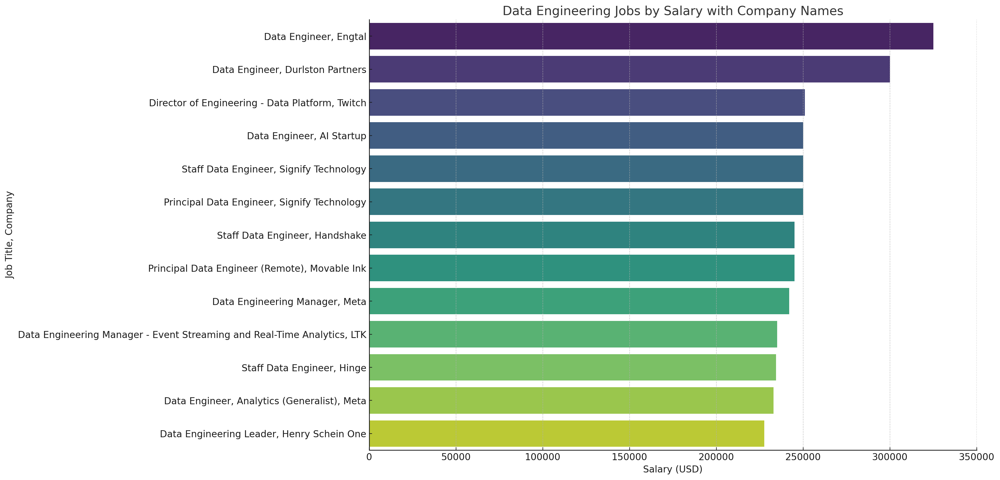
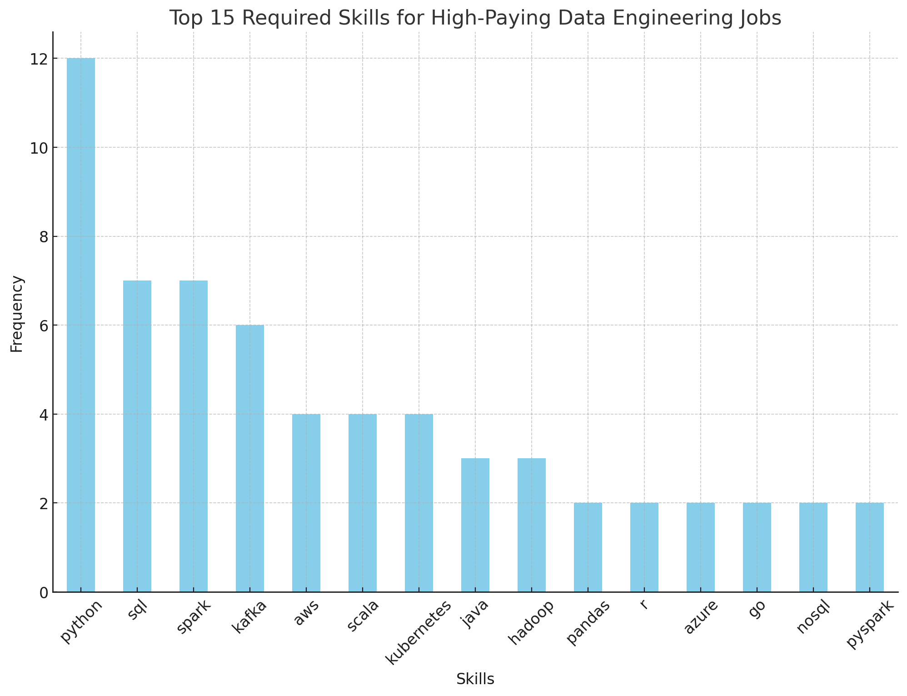

# Introduction

Dive into the data job market 📊
In this project, I’m focusing on data engineering roles, exploring the top-paying positions, the most in-demand skills, and where the highest demand meets the highest salaries in the field of data engineering.

You can find each SQL query in the [queries](/queries/) folder.

# Background

Driven by a quest to navigate the data engineering job market more effectively, this project was born from a desire to practice SQL and gain insights into job openings in 2023. The data hails from [DataNerd](https://datanerd.tech), packed with information on job titles, salaries, locations, and skills.

### The questions I wanted to answer through my SQL queries were:

- What are the top-paying data engineer jobs?
- What skills are required for these top-paying jobs?
- What skills are most in demand for data analysts?
- Which skills are associated with higher salaries?
- What are the most optimal skills to learn?

# Tools I used

For my research on the data engineer job market, I utilized these tools:

- **SQL**: Used to write queries and extract meaningful insights from the job data
- **PostgreSQL**: Managed the job posting database efficiently, allowing for seamless data retrieval
- **Visual Studio Code**: Provided an integrated environment for writing and running SQL queries and connecting to databases
- **Git & GitHub**: Enabled version control and collaborative sharing of SQL scripts and analysis

## Databases

To prepare for my research, I created and populated several databases. Here’s a summary of the steps involved:

### 1. Creating the Database

```sql
CREATE DATABASE sql_course;
```

### 2. Creating and configuring Tables

```sql
CREATE TABLE public.company_dim
(
    company_id INT PRIMARY KEY,
    name TEXT,
    link TEXT,
    link_google TEXT,
    thumbnail TEXT
);

CREATE TABLE public.skills_dim
(
    skill_id INT PRIMARY KEY,
    skills TEXT,
    type TEXT
);

CREATE TABLE public.job_postings_fact
(
    job_id INT PRIMARY KEY,
    company_id INT,
    job_title_short VARCHAR(255),
    job_title TEXT,
    job_location TEXT,
    job_via TEXT,
    job_schedule_type TEXT,
    job_work_from_home BOOLEAN,
    search_location TEXT,
    job_posted_date TIMESTAMP,
    job_no_degree_mention BOOLEAN,
    job_health_insurance BOOLEAN,
    job_country TEXT,
    salary_rate TEXT,
    salary_year_avg NUMERIC,
    salary_hour_avg NUMERIC,
    FOREIGN KEY (company_id) REFERENCES public.company_dim (company_id)
);

CREATE TABLE public.skills_job_dim
(
    job_id INT,
    skill_id INT,
    PRIMARY KEY (job_id, skill_id),
    FOREIGN KEY (job_id) REFERENCES public.job_postings_fact (job_id),
    FOREIGN KEY (skill_id) REFERENCES public.skills_dim (skill_id)
);

ALTER TABLE public.company_dim OWNER to postgres;
ALTER TABLE public.skills_dim OWNER to postgres;
ALTER TABLE public.job_postings_fact OWNER to postgres;
ALTER TABLE public.skills_job_dim OWNER to postgres;

CREATE INDEX idx_company_id ON public.job_postings_fact (company_id);
CREATE INDEX idx_skill_id ON public.skills_job_dim (skill_id);
CREATE INDEX idx_job_id ON public.skills_job_dim (job_id);
```

### 3. Filling Out Tables from CSV Files

```sql
COPY company_dim
FROM '/Users/antonbykov/projects/for-github-prep/SQL_Project_Data_Job_Analysis/company_dim.csv'
WITH (FORMAT csv, HEADER true, DELIMITER ',', ENCODING 'UTF8');

COPY skills_dim
FROM '/Users/antonbykov/projects/for-github-prep/SQL_Project_Data_Job_Analysis/skills_dim.csv'
WITH (FORMAT csv, HEADER true, DELIMITER ',', ENCODING 'UTF8');

COPY job_postings_fact
FROM '/Users/antonbykov/projects/for-github-prep/SQL_Project_Data_Job_Analysis/job_postings_fact.csv'
WITH (FORMAT csv, HEADER true, DELIMITER ',', ENCODING 'UTF8');

COPY skills_job_dim
FROM '/Users/antonbykov/projects/for-github-prep/SQL_Project_Data_Job_Analysis/skills_job_dim.csv'
WITH (FORMAT csv, HEADER true, DELIMITER ',', ENCODING 'UTF8');
```

This setup allowed me to effectively manage and analyze the data for my research on data engineering job trends.

# The Analysis

Each query for this project aimed at investigating specific aspects of the data engineer job market. Here’s how I approached each question:

### 1. Top Paying Data Engineer Jobs

To identify the highest-paying data engineering roles, I filtered the positions by average yearly salary and location, focusing specifically on remote jobs.

```sql
SELECT
    job_id,
    name AS company_name,
    job_title,
    job_schedule_type,
    job_no_degree_mention,
    job_country,
    salary_year_avg
FROM
    job_postings_fact
LEFT JOIN
    company_dim ON job_postings_fact.company_id = company_dim.company_id
WHERE
    job_title_short = 'Data Engineer'
    AND salary_year_avg IS NOT NULL
    AND job_location = 'Anywhere'
ORDER BY
    salary_year_avg DESC
LIMIT
    15;
```

Here’s a summary of the 15 top-paying data engineer job postings based on the analysis:
- **Wide Salary Range**: The top-paying data engineer roles span from $227,630 to $325,000, indicating significant earning potential within the field.
- **Diverse Employers**: Companies like Engtal, Twitch, Signify Technology, and Meta are among those offering the highest salaries, reflecting the broad interest across various industries.
- **Job Title Variety**: There’s a range of job titles, from Data Engineer to Director of Engineering - Data Platform, highlighting varied roles and specializations within data engineering.


*Bar graph visualizing the salary for the top salaries for Data Engineers in 2023 job postings; ChatGPT generated this graph from my SQL query results*

This analysis highlights the lucrative opportunities available in the data engineering job market, particularly for those with the right skills and experience.

### 2. Skills for Top Paying Jobs

To understand the skills required for the top-paying data engineering jobs, I analyzed the skill sets associated with these positions.
This analysis highlights the critical skills needed for securing top-paying data engineering jobs, emphasizing the importance of proficiency in Python, SQL, Spark, and other key technologies.

```sql
WITH top_de_jobs AS (
    SELECT
        job_id,
        name AS company_name,
        job_title,
        job_no_degree_mention,
        job_country,
        salary_year_avg
    FROM
        job_postings_fact
    LEFT JOIN
        company_dim ON job_postings_fact.company_id = company_dim.company_id
    WHERE
        job_title_short = 'Data Engineer'
        AND salary_year_avg IS NOT NULL
        AND job_location = 'Anywhere'
    ORDER BY
        salary_year_avg DESC
    LIMIT
        15
)

SELECT
    top_de_jobs.*,
    skills
FROM
    top_de_jobs
INNER JOIN
    skills_job_dim ON top_de_jobs.job_id = skills_job_dim.job_id
INNER JOIN
    skills_dim ON skills_job_dim.skill_id = skills_dim.skill_id;
```

Here’s a summary of the most demanded skills among the 15 highest paying data engineer jobs in 2023:
- Most In-Demand Skills:
    - **Python** leads the pack, being required in 12 of the top-paying jobs.
    - **SQL** and **Spark** are equally important, each appearing in 7 of these roles.
    - **Kafka** is also highly sought after, appearing in 6 jobs.
- Emerging Technologies:
    - **Kubernetes** and **Scala** each appear in 4 positions, reflecting the growing importance of container orchestration and functional programming in data engineering.
    - **AWS** is a key skill, also required in 4 roles, underscoring the importance of cloud computing.
- Additional Skills:
    - **Hadoop** and **Java** each appear in 3 positions, indicating a continued demand for these established technologies.
    - Skills like **Terraform**, **Redshift**, **PySpark**, **R**, **Databricks** and others appear in 2 positions or less each, highlighting the need for a diverse skill set in cloud platforms and data processing tools.


*Bar graph visualizing the number of high-paying Data Engineers jobs for each skill; ChatGPT generated this graph from my SQL query results*

### 3. In-Demand Skills for Data Engineer

To identify the most frequently requested skills in job postings, I analyzed the demand for various skills among Data Engineer positions.
This analysis highlights the key skills that data engineers should focus on to stay competitive in the job market, with a strong emphasis on SQL, Python, and cloud computing skills.

```sql
SELECT
    skills,
    COUNT(job_postings_fact.job_id) AS number_of_jobs
FROM
    job_postings_fact
INNER JOIN
    skills_job_dim ON job_postings_fact.job_id = skills_job_dim.job_id
INNER JOIN
    skills_dim ON skills_job_dim.skill_id = skills_dim.skill_id
WHERE
    job_title_short = 'Data Engineer'
    AND job_location = 'Anywhere'
GROUP BY
    skills
ORDER BY
    number_of_jobs DESC
LIMIT 25;
```

Here's the breakdown of the most demanded skills for data engineer in 2023:
- **SQL** is the most demanded skill, appearing in 14,213 job postings. This highlights its critical role in data manipulation and querying.
- **Python** closely follows with 13,893 job postings, indicating its importance in scripting and data processing.
- **Cloud Platforms**: Skills in cloud platforms like **AWS** (8,570), **Azure** (6,997), and **GCP** (3,049) are highly sought after, reflecting the industry’s shift towards cloud computing.
- **Big Data Technologies**: **Spark** (6,612), **Hadoop** (2,791), and **Kafka** (3,391) are essential for handling large-scale data processing.
- **Data Warehousing** and **ETL**: Tools like **Airflow** (4,329), **Snowflake** (4,053), **Redshift** (2,924), and **Databricks** (3,716) are frequently mentioned, underscoring the need for expertise in data warehousing and ETL processes.
- **Programming Languages**: Besides **Python**, **Java** (3,801) and **Scala** (3,346) are also in high demand, emphasizing the need for versatile programming skills.
- **Data Visualization** and **BI Tools**: **Tableau** (2,321) and **Power BI** (2,042) are essential for data visualization and business intelligence.
- **Version Control** and **Containerization**: Skills in **Git** (2,310) and **Docker** (2,246) are necessary for version control and containerization.

Here is a detailed breakdown of the top 25 in-demand skills for Data Engineers:

| Skill Name  | Number of Jobs |
|-------------|----------------|
| SQL         | 14,213         |
| Python      | 13,893         |
| AWS         | 8,570          |
| Azure       | 6,997          |
| Spark       | 6,612          |
| Airflow     | 4,329          |
| Snowflake   | 4,053          |
| Java        | 3,801          |
| Databricks  | 3,716          |
| Kafka       | 3,391          |
| Scala       | 3,346          |
| GCP         | 3,049          |
| Redshift    | 2,924          |
| Hadoop      | 2,791          |
| PySpark     | 2,459          |
| NoSQL       | 2,402          |
| Tableau     | 2,321          |
| Git         | 2,310          |
| Docker      | 2,246          |
| Kubernetes  | 2,076          |
| Power BI    | 2,042          |
| SQL Server  | 2,014          |
| MongoDB     | 1,866          |
| Oracle      | 1,764          |
| BigQuery    | 1,603          |
*Table of the demand for the top 5 skills in Data Engineer job postings*

### 4. Skills Based on Salary

Exploring the average salaries associated with different skills reveals which skills are the highest paying.
This analysis highlights the most lucrative skills for data engineers, emphasizing the value of specialized programming languages, advanced data science tools, and modern cloud and DevOps technologies.

```sql
SELECT
    skills,
    ROUND(AVG(salary_year_avg), 0) AS avg_salary
FROM
    job_postings_fact
INNER JOIN
    skills_job_dim ON job_postings_fact.job_id = skills_job_dim.job_id
INNER JOIN
    skills_dim ON skills_job_dim.skill_id = skills_dim.skill_id
WHERE
    job_title_short = 'Data Engineer'
    AND job_location = 'Anywhere'
    AND salary_year_avg IS NOT NULL
GROUP BY
    skills
ORDER BY
    avg_salary DESC
LIMIT 25;
```

Here's a breakdown of the results for top paying skills for Data Engineer:

- **High-Paying Programming Languages**:
    - **Assembly** commands the highest average salary at $192,500, reflecting its niche but critical role in low-level programming.
    - **Rust** and **Clojure** also offer high salaries, with averages of $172,819 and $170,867, respectively, indicating the value placed on modern, efficient programming languages.
- **Specialized Tools and Technologies**:
    - **Mongo** and **Neo4j**, both NoSQL databases, show high average salaries of $182,223 and $166,559, highlighting the importance of database management skills.
    - **Solidity**, used in blockchain development, offers an average salary of $166,250, reflecting the high demand for blockchain expertise.
- **Data Science** and **Analysis**:
    - **ggplot2** and **Julia**, tools commonly used in data science, command high average salaries of $176,250 and $160,500, respectively.
    - **Numpy** and **MXNet** also feature prominently, with average salaries around $157,500, underscoring the value of machine learning and numerical computing skills.
- **Cloud** and **DevOps Tools**:
    - **Kubernetes** offers an average salary of $158,190, reflecting its importance in container orchestration and DevOps.
    - **Bitbucket** and **Redis** are also highly valued, with average salaries of $160,333 and $157,000, respectively.
- **Miscellaneous**:
    - **Zoom** and **Trello**, though not traditionally seen as core data engineering tools, also appear on the list, suggesting their growing importance in remote collaboration and project management.

Here is a detailed breakdown of the top 25 skills based on average salary:

| Skill Name  | Average Salary (USD) |
|-------------|----------------------|
| Assembly    | 192,500              |
| Mongo       | 182,223              |
| ggplot2     | 176,250              |
| Rust        | 172,819              |
| Clojure     | 170,867              |
| Perl        | 169,000              |
| Neo4j       | 166,559              |
| Solidity    | 166,250              |
| GraphQL     | 162,547              |
| Julia       | 160,500              |
| Splunk      | 160,397              |
| Bitbucket   | 160,333              |
| Zoom        | 159,000              |
| Kubernetes  | 158,190              |
| Numpy       | 157,592              |
| MXNet       | 157,500              |
| FastAPI     | 157,500              |
| Redis       | 157,000              |
| Trello      | 155,000              |
| JQuery      | 151,667              |
| Express     | 151,636              |
| Cassandra   | 151,282              |
| Unify       | 151,000              |
| Kafka       | 150,549              |
| VMware      | 150,000              |
*Table of the average salary for the top 25 paying skills for data engineer*

### 5. Most Optimal Skills to Learn

Combining insights from demand and salary data reveals the most optimal skills for data engineers to learn in addition to the key skills that data engineers should have.
This analysis highlights the optimal skills for data engineers to focus on to maximize their market value, with an emphasis on modern technologies like Kubernetes, Python libraries, big data tools, and cloud platforms.

```sql
SELECT
    skills_dim.skill_id,
    skills_dim.skills,
    COUNT(job_postings_fact.job_id) AS number_of_jobs,
    ROUND(AVG(job_postings_fact.salary_year_avg), 0) AS avg_salary
FROM
    job_postings_fact
INNER JOIN
    skills_job_dim ON job_postings_fact.job_id = skills_job_dim.job_id
INNER JOIN
    skills_dim ON skills_job_dim.skill_id = skills_dim.skill_id
WHERE
    job_postings_fact.job_title_short = 'Data Engineer'
    AND job_postings_fact.job_location = 'Anywhere'
    AND job_postings_fact.salary_year_avg IS NOT NULL
GROUP BY
    skills_dim.skill_id
HAVING
    COUNT(job_postings_fact.job_id) > 10
ORDER BY
    avg_salary DESC,
    number_of_jobs DESC
LIMIT 25;
```

Here's a breakdown of the most optimal skills for Data Engineer in 2023:

- **High Demand** and **High Salary**:
    - **Kubernetes** leads the list with 56 job postings and an average salary of $158,190, indicating its critical role in container orchestration and DevOps.
    - **Numpy** is also highly valued, with 14 job postings and an average salary of $157,592, reflecting its importance in numerical computing and data analysis.
- Popular **Big Data** and **Cloud Technologies**:
    - **Cassandra** (19 jobs, $151,282) and **Kafka** (134 jobs, $150,549) are essential skills for big data management and stream processing.
    - **Terraform** (44 jobs, $146,057) and **Elasticsearch** (21 jobs, $144,102) are key cloud and search technologies with substantial demand and high salaries.
- **Programming Languages** and **Tools**:
    - **Golang** (11 jobs, $147,818) and **Ruby** (14 jobs, $144,000) offer lucrative opportunities for those proficient in these languages.
    - **Scala** (113 jobs, $141,777) and **Java** (139 jobs, $138,087) continue to be highly sought after, with strong salary prospects.
- **Machine Learning** and **Data Science**:
    - **PyTorch** (11 jobs, $142,254) and **Pandas** (38 jobs, $144,656) are crucial for machine learning and data manipulation, respectively.
    - **Spark** (237 jobs, $139,838) and **PySpark** (64 jobs, $139,428) are essential for large-scale data processing.
- **Databases** and **Data Warehousing**:
    - **DynamoDB** (27 jobs, $138,883) and **MongoDB** (32 jobs, $138,569) are highly valued NoSQL databases.
    - **Hadoop** (98 jobs, $137,707) remains a critical skill for big data storage and processing.
- **Additional Skills**:
    - **TypeScript** (19 jobs, $137,207) and **NoSQL** (93 jobs, $136,430) are essential for modern web and data applications.
    - **Shell scripting** (34 jobs, $135,499) and **Looker** (30 jobs, $134,614) are also valuable, reflecting the importance of scripting and data visualization.

Here are the top 25 skills that offer a combination of high demand and high average salary:

| Skill Name     | Number of Jobs | Average Salary (USD) |
|----------------|----------------|----------------------|
| Kubernetes     | 56             | 158,190              |
| Numpy          | 14             | 157,592              |
| Cassandra      | 19             | 151,282              |
| Kafka          | 134            | 150,549              |
| Golang         | 11             | 147,818              |
| Terraform      | 44             | 146,057              |
| Pandas         | 38             | 144,656              |
| Elasticsearch  | 21             | 144,102              |
| Ruby           | 14             | 144,000              |
| Aurora         | 14             | 142,887              |
| PyTorch        | 11             | 142,254              |
| Scala          | 113            | 141,777              |
| Spark          | 237            | 139,838              |
| PySpark        | 64             | 139,428              |
| DynamoDB       | 27             | 138,883              |
| MongoDB        | 32             | 138,569              |
| Airflow        | 151            | 138,518              |
| Java           | 139            | 138,087              |
| Hadoop         | 98             | 137,707              |
| TypeScript     | 19             | 137,207              |
| NoSQL          | 93             | 136,430              |
| Shell          | 34             | 135,499              |
| Looker         | 30             | 134,614              |
*Table of the most optimal skills for data engineer sorted by salary*

# Conclusion

### What I learned

Throughout this research project, I embarked on a practical journey that significantly enhanced my skills and understanding of the data engineering job market. Here are some key takeaways from my experience:
- **Advanced SQL Proficiency**: I honed my SQL skills by crafting complex queries to extract meaningful insights from the data. This involved joining multiple tables, using CTEs, and employing various aggregate functions to summarize the data effectively.
- **Database Management**: Setting up and managing the PostgreSQL database was a critical part of this project. I learned how to create and structure databases, define relationships between tables, and optimize queries for better performance.
- **Data Analysis** and **Visualization**: Analyzing the data to identify trends and insights required a combination of SQL and data visualization tools. I gained experience in using Python and libraries like Matplotlib and Seaborn to create compelling visual representations of the data.
- **Insightful Findings**: The analysis provided valuable insights into the job market, highlighting the most sought-after skills and the ones associated with higher salaries. This information is invaluable for data engineers looking to enhance their career prospects.
- **Real-World Application**: This project demonstrated the practical application of data engineering concepts in a real-world scenario. It reinforced the importance of continuously learning and adapting to new technologies and industry trends.

### Closing Thoughts

Overall, this research project was a comprehensive learning experience that deepened my understanding of the data engineering landscape and equipped me with practical skills that are highly relevant in the industry.